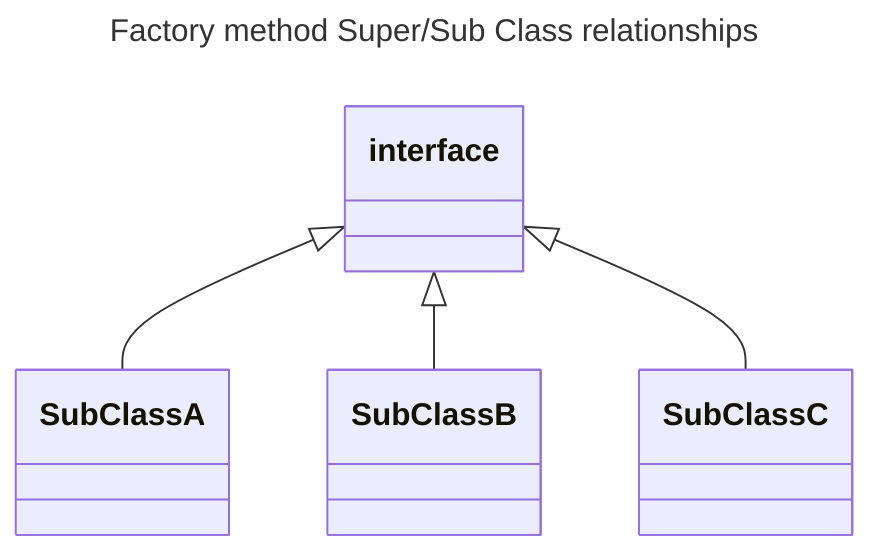
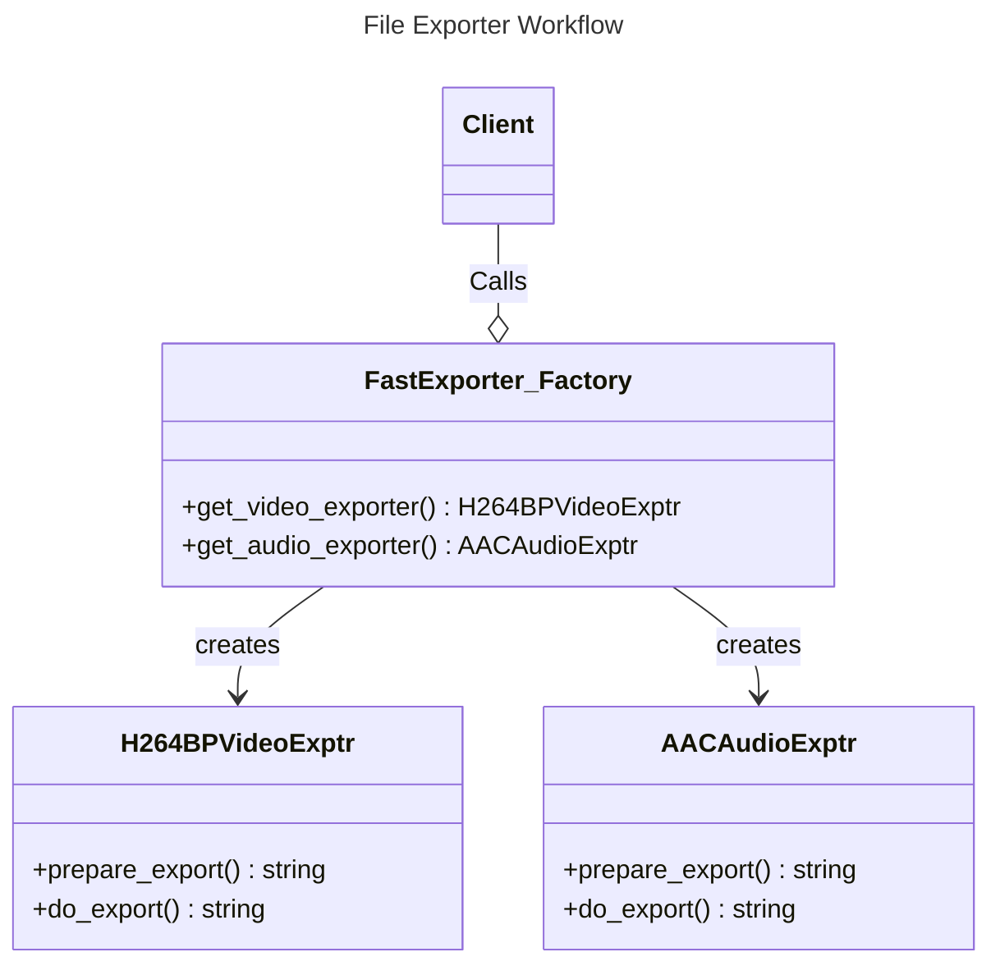

# Factory Method

Development Use Case: 
- Your application interacts with many different types of a thing
- For the most part the functions for instance are the same but there may be differences to be accounted for

Development Problems: 
- Reduction in readability of code: 
	- The small differences require a bunch of `if-statements`, this can lead to a cluttered codebase 
- Reduction in manageability over time: 
	- When changes occur there will be multiple places where the maintainer will have to change 

Factory method solution:
- separate Creation of an object from the Use of the object 
	- Instead of calling the object directly in the main function, you call a "factory" to return an object
	- This increases code maintainability by allowing object definition to happen in one place , without having to change any parameters at the point where its instantiated 
- Use an interface that will then allow for the different types to be built as subclasses
- Use a "factory" interface to create "factories " that create and return those subclasses 
- The superclass interface "manufactures" classes
	-  the `type` instance will hold its unique functionality upon creation

Four main components to a factory method: 
1. Abstract interface 
	1. defines the  base functionality for the static classes 
2. Concrete class 
	1. the specific class that implements the static interface 
3. Abstract Factory Interface 
	1. the interface that defines the functionality of the Factory instance 
4. the factory class
	1. the class that implements the factory interface and returns a concrete class

The advantage: 
	- the client only has to implement an instance of the factory  to create the instance . 
	- functionality is abstracted and automated, keeping the code easy to read
	- creates a loose coupling ``

The issues: 
	- abstraction creates complexity 
	- depending on how similar types are, you can run into code duplication 

## Factory Implementation: File Exporter
---

